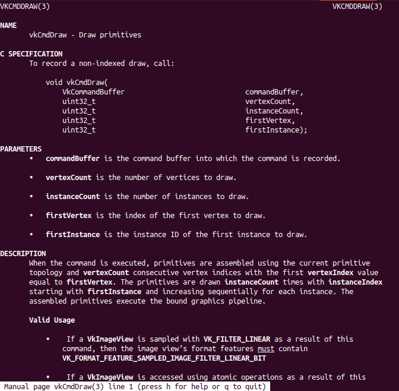

# vkdocs-manpages-autogensh

Auto-generator Vulkan-Docs manpages
Tested mainly on Ubuntu but should works the same on other distros.
Not tested on macOS, and Windows. It would need slightly modifications on top of parameters supplied to each command as it might have different variants. PRs welcome.

[Vulkan-Docs](https://github.com/KhronosGroup/Vulkan-Docs) has man source files which can be converted into manpages with a few clean-up/reformat ontop but
their decision doesn't include maintaining of manpages generation code in the repo. So in short, it is possible to do it and this project will serve that purpose.

# Pre-Built Manpages for Downloads

In case you don't have time or don't want to build it yourself, head over to downstream Vulkan-Docs repository's [release](https://github.com/haxpor/Vulkan-Docs/releases) section, then you can download manpages (either as original `.3` or `.gz` file) as zip file there. Extract it to your system proper location then you're ready to use.

If you use WSL (Linux subsystem in Windows), recommended to download `.gz` zip file then extract it into `/usr/share/man/man3`. Then execute `sudo mandb` to update and index man pages.

# Example

Notice those <u>normative</u> keywords, and **inline code** format.

# Dependency

* NodeJS (only if users target to build manpages against `Vulkan-Docs` API version `v1.2.137` or newer)
* Asciidoctor (package name `asciidoctor` on debian-based distro)

# How To

## Build

* `make` - Build lastest spec release version
* `make SPECV=v1.2.138` - Build a custom spec release version. `SPECV` shorts for spec version. You can get list of spec versions [here](https://github.com/KhronosGroup/Vulkan-Docs/releases). **Note:** For now, all 1.2.x series are built without errors.

## Install

`make install`

This will install all generated manpages from `Vulkan-Docs/out/man/` to your `/usr/local/man/man3/`.

## Clean

`make clean`

This will remove all generated files resulting from `make`. This will only remove generated files inside Vulkan-Docs directory.
It doesn't have any effect to your installed manpages on your system.

## Purge

`make purge`

This will remove entire directory `Vulkan-Docs`. This is equivalent of manually removing such directory yourself.

# Behind the scene

The script will perform the following operations

* Clone [Vulkan-Docs](https://github.com/KhronosGroup/Vulkan-Docs) into `Vulkan-Docs` then make sure everytime it has the lastet commits and (release) tags.
* (if need) Perform installation of packages from `npm` (NodeJS)
* Make sure the repo is latest
* Start fresh, and checkout a target release tag of per instructed (if not supply via command line's parameter, then it will base on lastest release)
* Inject patch for `Makefile` as seen from `patches/Makefile` without heavily modify original `Makefile` source that much
* Clean `Vulkan-Docs` to ensure freshness on behalf of its `Makefile`
* Build manpages only `Vulkan-Docs` on behalf of its `Makefile`
* Clean or reformat some artifacts as seen from generated manpages

# Credits

Thanks to Ryp for his inspiring [PR](https://github.com/KhronosGroup/Vulkan-Docs/pull/839/files) to make manpages generation possible.
The core logic to generate manpage of this project is based on top of that.

# License

The script files of this repository **not** include the genereated artifact, man source files, or generated manpages are licensed under [MIT](https://github.com/haxpor/vkdocs-manpages-autogensh/blob/master/LICENSE), Wasin Thonkaew.

Artifactrs, man source files, or generated manpages (simply, what's inside `Vulkan-Docs` directory) are based on original [Vulkan-Docs's multiple Licenses](https://github.com/KhronosGroup/Vulkan-Docs/blob/master/COPYING.md).
